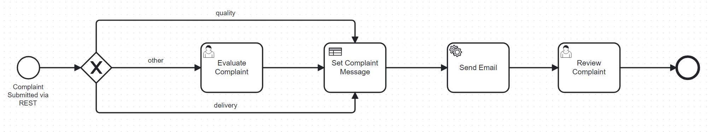
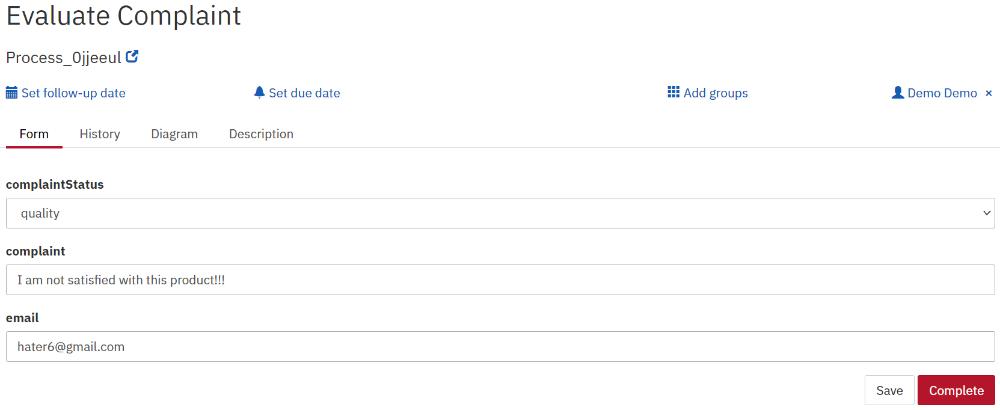
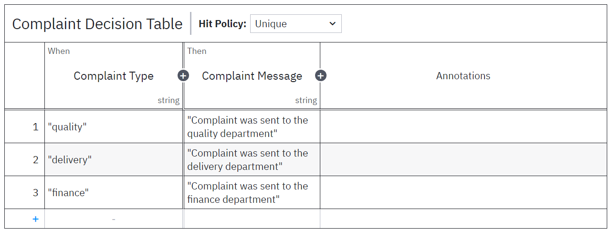
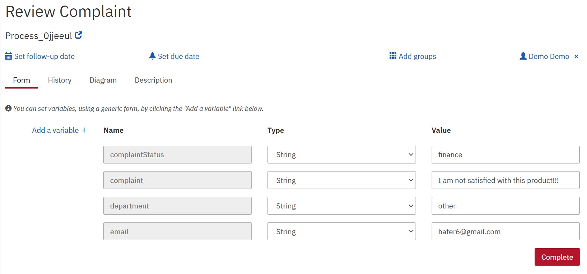

# Mini Project 2
## Gruppe: Pejomi (Mie, Jonas, Peter)

Projektet gør brug af Camunda og Java.

## Business Scenario
Vi har udviklet en klageportal for en fiktiv virksomhed, som skal gøre det muligt for brugere at indsende klager til særlige afdelinger, som f.eks. "Quality" og "Delivery".
Hvis den specificerede afdeling ikke genkendes, skal klagen sendes til "Other", hvor klagen så kan blive behandlet af en medarbejder.
Vi har udarbejdet følgende BPMN-diagram for at illustrere processen:

Følgende billede viser, hvordan det ser ud for medarbejderen, når han skal behandle en klage manuelt:

Følgende billede illustrerer den Decision Table der bestemmer indholdet af mailen der bliver sendt til brugeren:

Følgende billede illustrerer, hvordan det ser ud for medarbejderen, når han skal reviewe en klage som det sidste led i processen:

Service task'en bliver udført af `SendEmailWorker.java` klassen.